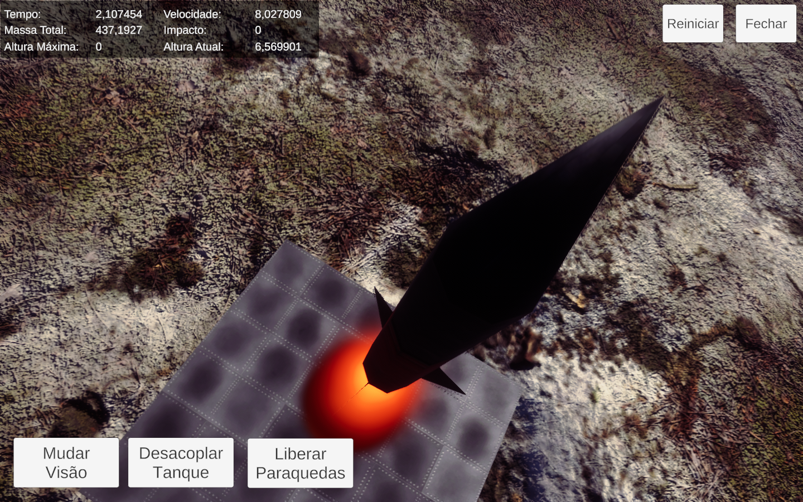
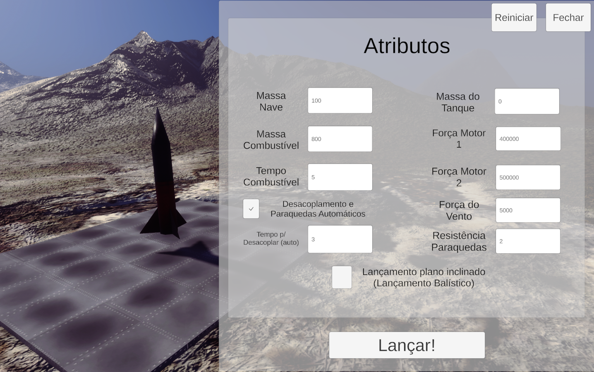
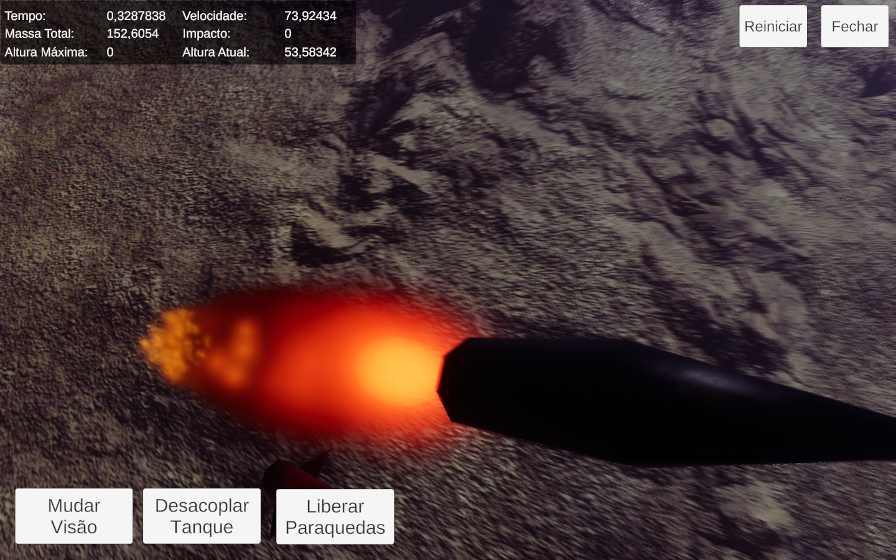

# Simulador de lançamento de foguete

Esse projeto 3D simula o lançamento, desacoplagem e pouso com paraquedas de um foguete.
Toda a simulação foi criada para atender as leis da física, e o material de estudos em que ele foi baseado, foi retirado do site oficial da NASA:
https://www.grc.nasa.gov/WWW/K-12/rocket/rktflight.html

 *Observação importante:*
Não é necessário ter a Unity nem qualquer outro programa instalado para testar, pois a pasta Build está com todos os arquivos necessários para rodar o projeto já buildado, bastando apenas abrir o arquivo "Rocket Launcher.exe"!

## Totalmente configurável e focado em métricas em tempo real

Como qualquer simulador, além da representação gráfica em 3D do lançamento, é possível configurar diversos parâmetros e também visualizar vários outros em tempo real:
A possibilidade de alterar:
 - Massa da nave.
 - Massa do Tanque de Combustível.
 - Massa Total do combustível.
 - Tempo de duração do combustível.
 - Força do primeiro e do segundo motor.
 - Decidir entre automático de manual:
  - Desacoplagem automática com tempo programado.
  - Desacoplagem manual podendo ser executada a qualquer momento pelo usuário.
  - Paraquedas automático ao iniciar a queda.
  - Paraquedas manual acionado pelo usuário.
 - Força do vento aplicada.
 - Resistência do Paraquedas.

 Também, para facilitar a análise do usuário, deixei disponíveis as seguintes informações em tempo real:
 - Tempo restante
 - Massa total
 - Altura Máxima
 - Velocidade atual
 - Impacto
 - Altura atual.

 Visualmente eu foquei em permitir a visualização por vários pontos de vista e ângulos de câmera usando o módulo Cinemachine da Unity. Também utilizei alguns efeitos de pós-processamento para melhorar a qualidade visual por meio dos Volumes do HDRP.

Dos recursos usados, utilizei apenas ferramentas internas da Unity e um único pack de assets (para terreno: Texturas, brushes, etc) que também era da Unity. Os únicos arquivos utilizados de fora, foram as texturas de metal da plataforma de lançamento e os modelos 3D do foguete e do paraquedas. 

